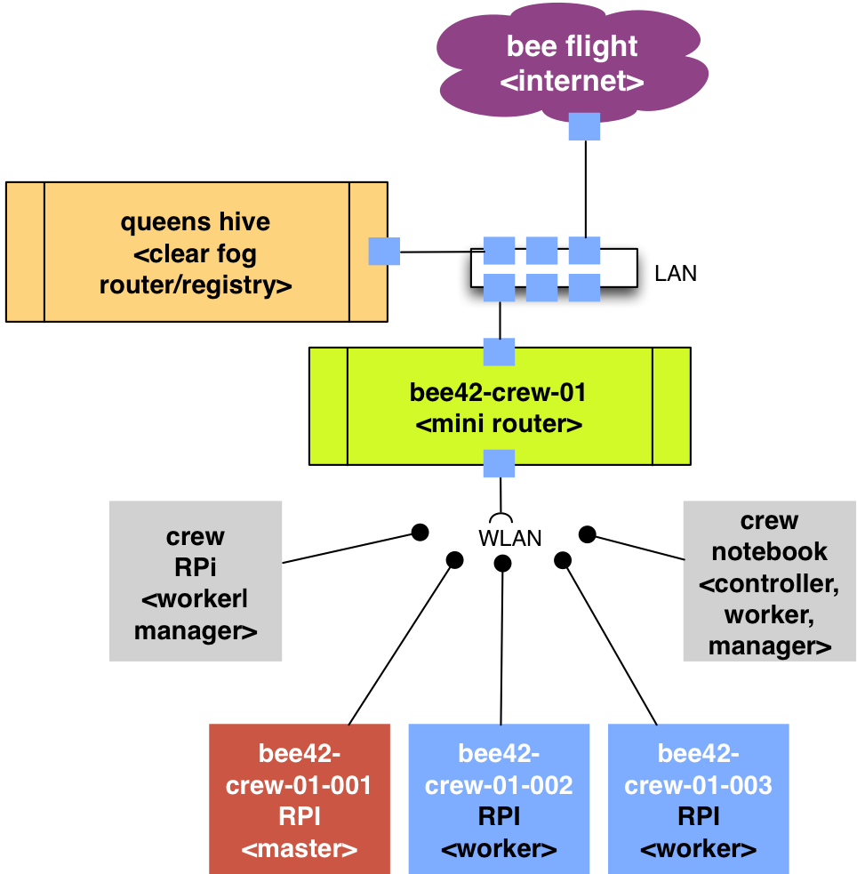
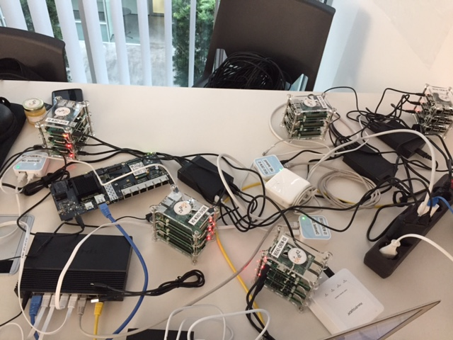
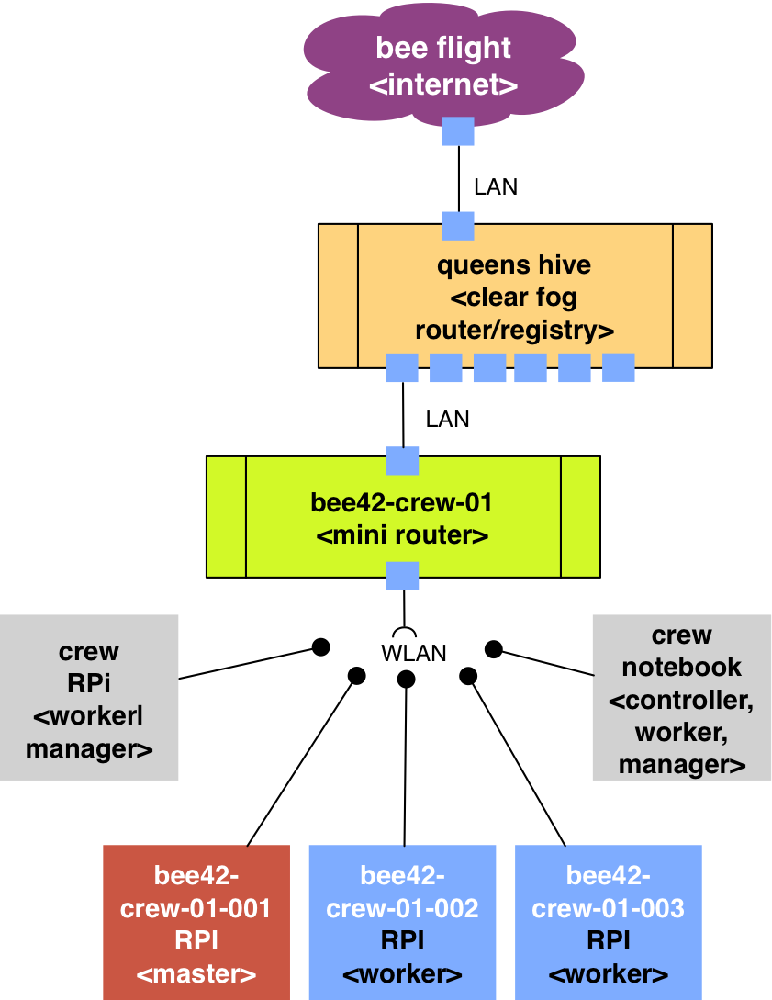
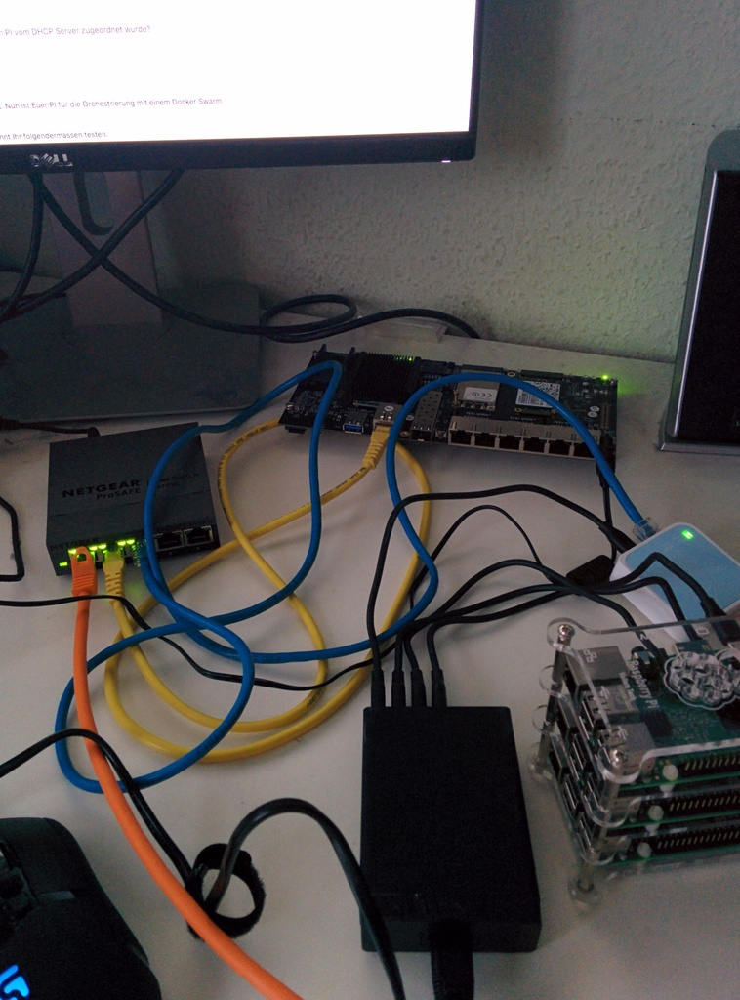
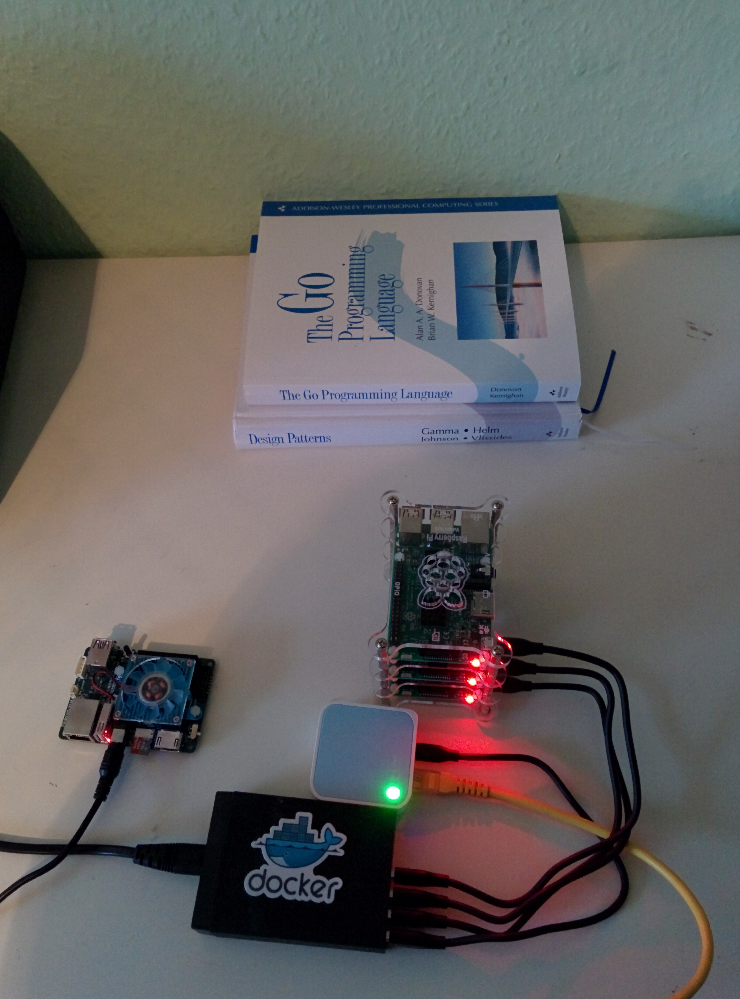
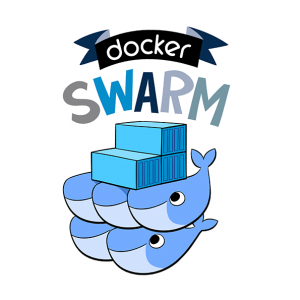

# Docker Raspberry-Pi-3 Swarming Lab

Docker verursacht eine systemische Singularität nicht nur im Bereich der Virtualisierung. Das aktuelle Docker Release 1.12 ist ein enormer Schritt in ein neues Zeitalter der IT, wenn Docker nun auf Windows, Linux und Low-Power-ARM-Geräte bereitsteht. Sehr viele bestehende Hindernisse der IT existieren mit dem Einsatz von Docker einfach nicht mehr. Die Kooperation von Anwendungen und Entwicklern ist ein großes Stück vereinfacht worden. Die Bereitstellung von Software ist durch Docker wesentlich beschleunigt und mit dem Einsatz der Werkzeuge und Plattformen aus dem Docker-Ökosystem sicherer geworden. Das Erkennen und Beheben von Engpässen hat sich vereinfacht. Die Analyse der Probleme von Systemen ist nun vor der Produktion durch die Entwickler und Administratoren gemeinsam möglich. Mit dem Docker Release 1.12.x steht Docker auf Embedded Systems bereit und das ist eine wirkliche Bereicherung. Nach unten skalieren auf das absolute Minimum, beschleunigt die Entwicklung und bereitet Dich persönlich darauf vor, im wirklich großen Stil zu liefern.

In diesem Docker-Lab wird erklärt, wie Du Deinen kompletten Software-Stack auf einem Raspberry-Pi-3 Cluster bereitstellen kannst. Es werden die Grundlagen des Docker Swarming Mode erklärt und welche Use Case auf einem PI heute schon mit Docker möglich sind.

Die beschriebene Idee sind die Dokumentation des Testaufbau's und die Beispiele für das Docker Meetup Bochum 25.10.2016.

* http://www.meetup.com/de-DE/Docker-Bochum/events/234324255/


## Aufbau des Labs - Erzeuge ein Queenshive

Damit verschiedene Crew's im Lab separat arbeiten können, haben wir
einen [Clear Fog PRO](https://www.solid-run.com/marvell-armada-family/clearfog/)- Router von SolidRun eingesetzt. Dieser Router ist unser Bienenstock zum Internet und hostet die Lab Docker-Registry. Der Clear Fog ist für heute unsere Queens Hive :honeybee:

* https://blog.hypriot.com/post/introducing-the-clearfog-pro-router-board/
* https://blog.hypriot.com/post/clearfog-pro-part-2-lets-run-docker/

### Aufbau mit einem Switch





### Aufbau als Router



**Experiment**:

Weitere Informationen zum Setup der [Queens hive](ClearFog-queens-bee-setup.md) stehen zur Verfügung.



### Alternative

Der erste Testaufbau von Niclas ist uns mit einem [ODROID-XU3](http://odroid.com/dokuwiki/doku.php?id=en:odroid-xu3) gelungen:



### Mini Router Setup

Jedem Team steht ein Mini Router und eignes WLAN zur Verfügung.


```
crew number: 01|02|03|04|05
access WLAN: SSID: bee42-crew-<crew number>, pw: beehive42
IP: 192.168.<crew number>.1
login: ssh pirate@192.168.<crew number>.1
password: hypriot
```

```
Swarm manager: bee42-crew-<crew number>-001
Swarm worker 1: bee42-crew-<crew number>-001
Swarm worker 2: bee42-crew-<crew number>-002
Swarm worker 3: bee42-crew-<crew number>-003
```

* [Mini Router Setup](TP-Link-setup.md)

## Einkaufswagen füllen, bestellen, bezahlen, installieren und Spaß haben!

Alle Komponenten die Ihr braucht um einen Docker PI-Cluster aufzubauen können in der Regel preiswert und zuverlässig bestellt werden. Wir haben uns an der Liste von [Roland Huss](https://ro14nd.de/kubernetes-on-raspberry-pi3) orientiert:

Danke Roland :-)

Unser Ziel ist es eine möglichst einfache Aufbau eines Raspberry-Pi-3 Cluster für Docker 1.12.x mit __swarming mode__ bereitzustellen.

Stand 2016-10. ca. 232 Euro

| Anzahl | Teil                                                         | Preis      |
|:-------|:-------------------------------------------------------------|:-----------|
| 3      | [Raspberry Pi 3](http://www.watterott.com/de/Raspberry-Pi-3) | 3 * 38 EUR |
| 3      | [Micro SD Card 32 GB](http://www.amazon.de/dp/B013UDL5RU)    | 3 * 11 EUR |
| 1      | [WLAN Router](http://www.amazon.de/dp/B00XPUIDFQ)            | 22 EUR     |
| 4      | [USB Kabel](http://www.amazon.de/dp/B016BEVNK4)              | 9 EUR      |
| 1      | [USB Stromgerät](http://www.amazon.de/dp/B00PTLSH9G)         | 30 EUR     |
| 1      | [Gehäuse](http://www.amazon.de/dp/B00NB1WPEE)                | 10 EUR     |
| 2      | [Zwischenplatten](http://www.amazon.de/dp/B00NB1WQZW)        | 2 * 7 EUR  |

* Option: Kühler für die PI kaufen und installieren

## SD-Karten für den beehive PI-Cluster vorbereiten

Es gibt mehrere Möglichkeiten ein RPi-Image auf eine SD-Karte zu bekommen. Wir nutzen für diesen Anwendungsfall das [Flash Tool der Hypriot Priraten](https://github.com/hypriot/flash). Als Basis der Installation verwenden wir das aktuelle [Hypriot OS](https://github.com/hypriot/image-builder-rpi/).

### Installation des Werkzeuges Flash unter Linux / OS X

Mit folgendem Befehlen installiert Ihr das Hypriot Flash Tool:

```
$ curl -O https://raw.githubusercontent.com/hypriot/flash/master/$(uname -s)/flash && \
$ chmod +x flash && \
$ sudo mv flash /usr/local/bin/flash
```

### Download des Hypriot OS-Images

Download des Images:

```bash
$ mkdir OS-Images
$ cd OS-Images
$ HOS_VERSION=1.1.1
$ HOS_URL=https://github.com/hypriot/image-builder-rpi/releases/download
$ curl -LO ${HOS_URL}/v${HOS_VERSION}/hypriotos-rpi-v${HOS_VERSION}.img.zip
```

Entpacken des Images:

```bash
$ unzip hypriotos-rpi-v${HOS_VERSION}.img.zip
```

### Dirty Cow


***
* http://blog.hypriot.com/post/fix-dirty-cow-on-raspberry-pi/

```
$ docker run --rm hypriot/rpi-dirtycow
$ sudo apt-get update
$ sudo apt-get install raspberrypi-kernel
$ sudo reboot
# reconnect to your arm device
# if you docker engine doesn't come back
$ sudo systemctl restart docker.service
```


### Erstellen der Konfiguration `device_init.yaml`

Hier ist eine Beispiel für eine `device_init.yaml`:


```yml
hostname: "bee42-crew-01-001"
wifi:
  interfaces:
    wlan0:
      ssid: "bee42-crew-01"
      password: "beehive42"
```

**Bitte** die Änderung des Hostnames und der Zugangsdaten des Routers (SSID und password) vornehmen.

Damit könnt Ihr nun in Euerer Umgebung den RPi prägen und dann einfach ausprobieren.

### Flashen des OS-Images

Nach Erstellung der Datei `device_init.yaml` könnt Ihr diese direkt mit auf die SD-Karte flashen. Ansonsten könnt ihr auch nach dem flashen die `device_init.yaml` direkt auf dem PI bearbeiten.

```bash
$ flash -c device_init.yaml hypriotos-rpi-v1.1.0.img
```

## Raspberry-Pi starten

Nach dem Einsetzen der Karten könnt Ihr den Raspberry-PI starten. Wenn alles geklappt sollte dieser mit dem WLAN verbunden sein. Nun könnt Ihr Euch mit dem PI per SSH verbinden.

```bash
$ ssh pirate@<ip>
```

__Frage__: Wie bekommt eigentlich heraus welche IP dem PI vom DHCP Server zugeordnet wurde?

```
# install nmap
$ brew install nmap
$ nmap -sn 192.168.178.0/24
```

Das Passwort für den Nutzer __pirate__ lautet: **hypriot**. Nun ist Euer PI für die Orchestrierung mit einem Docker Swarm Clusters bereit.

Ob Docker überhaupt korrekt installiert ist, könnt Ihr folgendermassen testen:

```bash
# password hypriot
# <ip> 192.168.1.100 | 192.168.1.101 | 192.168.1.102 
$ ssh pirate@<ip>
$ docker info
$ docker version
```
Im Blog der Hypriot Piraten findet Ihr jede Mengen Erklärungen zum Thema Docker on ARM:

* https://blog.hypriot.com/getting-started-with-docker-on-your-arm-device/
* https://hub.docker.com/u/hypriot/

## Aktiviere Docker Registry auf Deinem PI

```
$ cat >/etc/docker/daemon.json <<EOF
{
 "insecure-registries": [ "beehive:5000", "192.168.178.97:5000" ]
}
EOF
$ systemctl restart docker.service
$ cat >> /etc/hosts <<EOF
192.168.178.97 beehive
EOF
$ docker run -ti --rm beehive:5000/bee42/rpi-alpine
```

## Docker Engines der Pi's auf dem Mac verfügbar machen


* Mehrere PI's mit Machine Remote verfügbar machen
* https://github.com/docker/machine/pull/3605#issuecomment-239624969

**WARNING**: Bitte diese Befehle nicht auf den Crew Pi's anwenden, sonst werden die verteilen Zertifikate ersetzt und die anderen Crew Mitglieder haben keinen Zugang mehr zu den Pi's.


[Create SSH Key](https://help.github.com/articles/generating-a-new-ssh-key-and-adding-it-to-the-ssh-agent/#generating-a-new-ssh-key)

```
$ ssh-copy-id pirate@192.168.1.001
```

FIX docker-machine ssh for hypriot os

* https://github.com/DieterReuter/arm-docker-fixes/tree/master/001-fix-docker-machine-1.8.0-create-for-arm

```
$ ssh pirate@192.168.1.001
> curl -sSL https://github.com/DieterReuter/arm-docker-fixes/raw/master/001-fix-docker-machine-1.8.0-create-for-arm/apply-fix-001.sh | bash
> exit
```

```
#!/bin/sh
set -x

# access the Raspberry Pi running Raspbian/Jessie
IPADDRESS=192.168.1.001
PI_HOSTNAME=bee42-crew-01-001
PI_USERNAME=pirate
PI_PASSWORD=hypriot

# deploy a Docker 1.12.1 on ARMv6 or ARMv7 Raspbian/Jessie
mkdir -p /ssd/beehive-world
docker-machine --debug create \
  --storage-path=/ssd/beehive-world/ \
  --engine-storage-driver=overlay \
  --driver=generic \
  --generic-ip-address=$IPADDRESS \
  --generic-ssh-user=$PI_USERNAME \
  --engine-install-url=https://get.docker.com/ \
  $PI_HOSTNAME
```

```
#!/bin/bash
set -e

CREW_NUMBER=01
MACHINE_ID=002
MACHINE_NAME="bee42-crew-$CREW_NUMBER-$MACHINE_ID"

IP_ADDRESS=192.168.1.101
SSH_PORT=22

PI_USERNAME=pirate
PI_PASSWORD=hypriot

SSH_KEY_SIZE=4096
SSH_KEY_ALGO=rsa

STORAGE_PATH=$PWD/machine-config

#if [ -f "$HOME/.ssh/id_rsa.pub" ]; then

#  ssh -p $SSH_PORT -q $PI_USERNAME@$IP_ADDRESS exit
 # if [ $? -ne 0 ]; then
  #  echo "Copy SSH Key to: \n $PI_USERNAME@$IP_ADDRESS:$IP_PORT "
   #ssh-copy-id "$PI_USERNAME@$IP_ADDRESS -p $SSH_PORT"
  #fi
#else

 # echo "Generate Key for User $(whomai)"
  #ssh-keygen -t $SSH_KEY_ALGO -b $SSH_KEY_SIZE

  #echo "Copy SSH Key to: \n $PI_USERNAME@$IP_ADDRESS:$IP_PORT "
  #ssh-copy-id "$PI_USERNAME@$IP_ADDRESS -p $SSH_PORT"
#fi

# deploy a Docker 1.12.1 on ARMv6 or ARMv7 Raspbian/Jessie
docker-machine --debug --storage-path=$STORAGE_PATH create \
  --driver=generic \
  --generic-ip-address=$IP_ADDRESS \
  --generic-ssh-port=$SSH_PORT \
  --generic-ssh-user=$PI_USERNAME \
  --engine-install-url=https://get.docker.com/ \
  --engine-storage-driver=overlay \
  $MACHINE_NAME

echo "Now lets connect to the machine"
```

### Zertifikate herunterladen und Remote nutzen

* mit scp von allen Pi in einer Schleife alle Certs besorgen.
* Kleiner Datei baum

```
$ mkdir beehive/<host>/
$ scp ca.pem|cert.pem|key.pem
```

* Beispiel des Zugriffs mit alias in der shell

```
# Configures the path to the ca.pem, cert.pem, and key.pem files used for TLS verification. Defaults to ~/.docker.
$ DOCKER_CERT_PATH=
# Sets the URL of the docker daemon. As with the Docker client, defaults to unix:///var/run/docker.sock.
$ DOCKER_HOST=
$ DOCKER_TLS_VERIFY=1
$ docker info
```

### ARM based Docker Machine

Das gibt es bei Hypriot in der Package-Cloud:
https://packagecloud.io/Hypriot/Schatzkiste/packages/debian/jessie/docker-machine_0.8.2-36_armhf.deb

Dann noch den Fix auf den Pi’s ausführen:
https://github.com/DieterReuter/arm-docker-fixes/tree/master/001-fix-docker-machine-1.8.0-create-for-arm

## Docker Swarming



* `cd slides/docker-on-arm`
* `cd examples/docker/rpi-tomcat-8`
* https://speakerdeck.com/rossbachp/docker-on-arm-docker-meetup-bochum-2016-10

Mehr über PI Cluster und Docker swarming

* https://blog.docker.com/2016/07/swarm-mode-on-a-raspberry-pi-cluster/
* https://blog.hypriot.com/post/deploy-swarm-on-chip-with-docker-machine/
* https://medium.com/@bossjones/how-i-setup-a-raspberry-pi-3-cluster-using-the-new-docker-swarm-mode-in-29-minutes-aa0e4f3b1768#.e7v3b6xer
* http://blog.alexellis.io/docker-swarm-mode-part1/
* http://blog.alexellis.io/microservice-swarm-mode/

### Cluster erzeugen

```bash
$ docker swarm init
```

Nun erhalten wir zwei Tokens einen Manger und einen Worker Token. Manager haben die Kontrolle über den Cluster und Worker führen nur die eingehenden Aufgaben aus.

### Cluster Tokens sichtbar machen und rotieren lassen

Um die Tokens nachschauen zu können muss man in dem Cluster sein. Docker stellt eine Befehl zu Verfügung um Tokens sichtbar zu machen oder auch rotieren zu lasen.

```bash
$ docker swarm join-token [--rotate] (worker|manager)
```

### Einen Worker Node zum Cluster hinzufügen

```
$ docker swarm join --token "super-secret" ip:2377
```

### Beispiel für den Start eines Services

```
$ docker service create --name whoami queenshive:5000/bee42/whoami
$ docker service update --replicas 2  whoami
$ docker service inspect whoami
```

### Examples whoami


* `cd exmaples/docker/rpi-whoami`
* https://github.com/emilevauge/whoamI

```
$ docker run -d -P --name iamfoo queenshive:5000/bee42/rpi-whoami
$ docker inspect --format '{{ .NetworkSettings.Ports }}'  iamfoo
map[80/tcp:[{0.0.0.0 32769}]]
$ curl "http://0.0.0.0:32769"
Hostname :  6e0030e67d6a
IP :  127.0.0.1
IP :  ::1
IP :  172.17.0.27
IP :  fe80::42:acff:fe11:1b
GET / HTTP/1.1
Host: 0.0.0.0:32769
User-Agent: curl/7.35.0
Accept: */*
```

### Erzeugen einen Service und skalieren

```
$ docker service create --name whoami queenshive:5000/bee42/rpi-whoami
$ docker service update --replicas 2  whoami
$ docker service inspect whoami
[
    {
        "ID": "ch1cizq1k61qigbswzdd0sryj",
        "Version": {
            "Index": 717
        },
        "CreatedAt": "2016-06-19T11:01:39.630354919Z",
        "UpdatedAt": "2016-06-19T11:02:20.137102719Z",
        "Spec": {
            "Name": "whoami",
...
]
$ docker service inspect whoami |jq "{ name: .[].Spec.Name , replicas: .[].Spec.Mode.Replicated.Replicas}"
{
  "name": "whoami",
  "replicas": 2
}
```

### Finde neue Möglichkeiten für Deinen RPI Docker Cluster

#### UUID

build examples

```
cd examples/docker/rpi-tomcat-8
cat >Dockerfile.uuid <<EOF
FORM bee42/rpi-tomcat:rpi-8
ADD webapps/uuid /opt/tomcat/webapps/uuid
EOF
docker build -t bee42/uuid -f Dockerfile.uuid .
docker tag bee42/uuid queenshive:5000/bee42/uuid
```

play around

```
$ ssh pirate@192.168.3.1
> docker service create --publish 9000:9000 --name guid queenshive:5000/bee42/uuid
> docker service ls
> curl localhost:9000/guid
> docker service scale guid=3
> curl localhost:9000/guid
> curl localhost:9000/guid
> curl localhost:9000/guid
> docker service scale guid=0
> docker service rm guid
> docker service ls
> exit
```

* Create a newer version
* generate a moderate load with a simple foreach statement
* Deploy next version with rolling update
* Setup ping HEALTHCHECK
  * Memory
  * CPU
  * To much Threas
  * Availability service
* Setup Traefik
  * auto swarming mode

# Aufräumen des Host-Systems

## Entfernen von Flash

```bash
$ sudo rm /usr/local/bin/flash
```

## Entfernen der Zertifkate


```bash
$ rm -rf beehive
```


Viel Spaß

```
Peter Roßbach <peter.rossbach@bee42.com> @PRossbach
Niclas Mietz <niclas.mietz@bee42.com> @solidnerd
```
