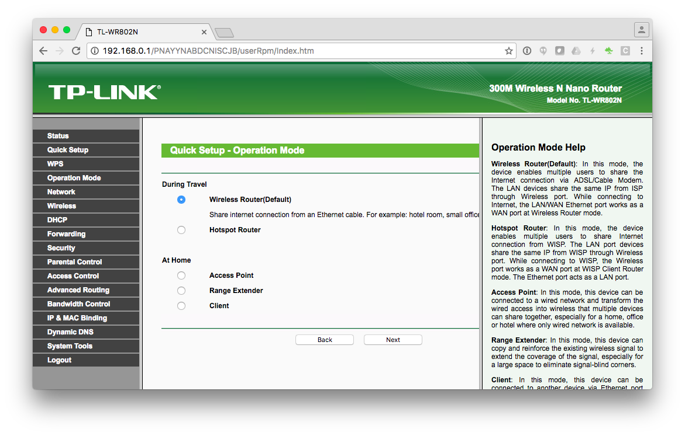
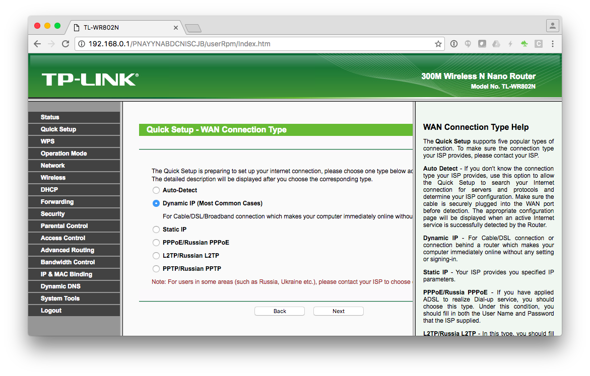
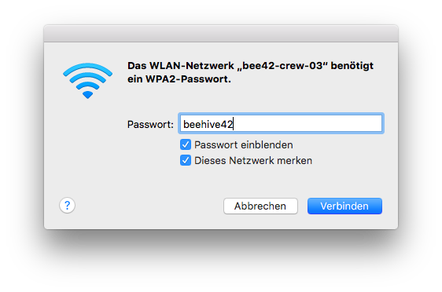
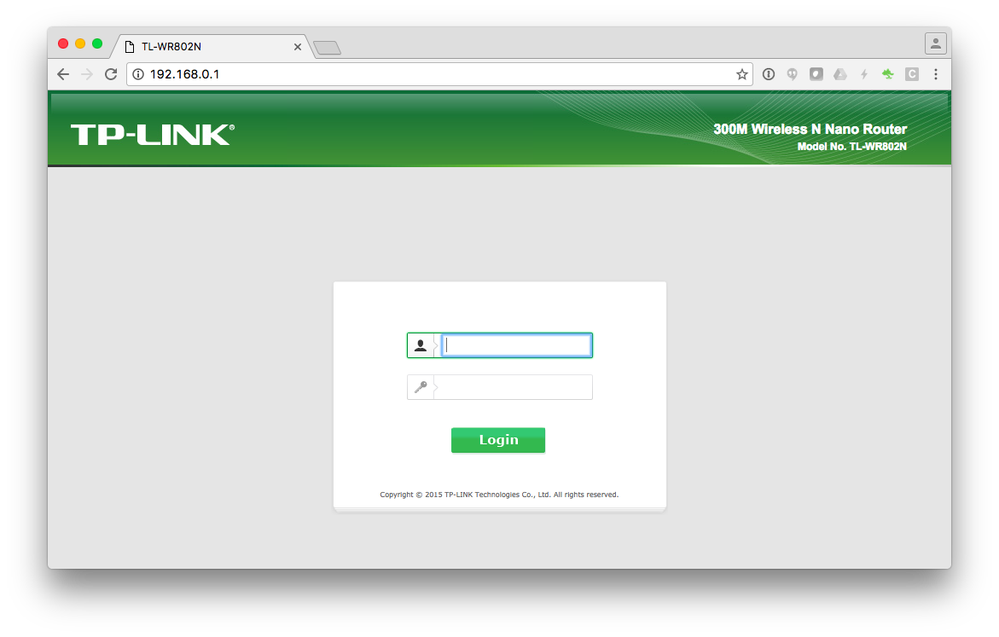
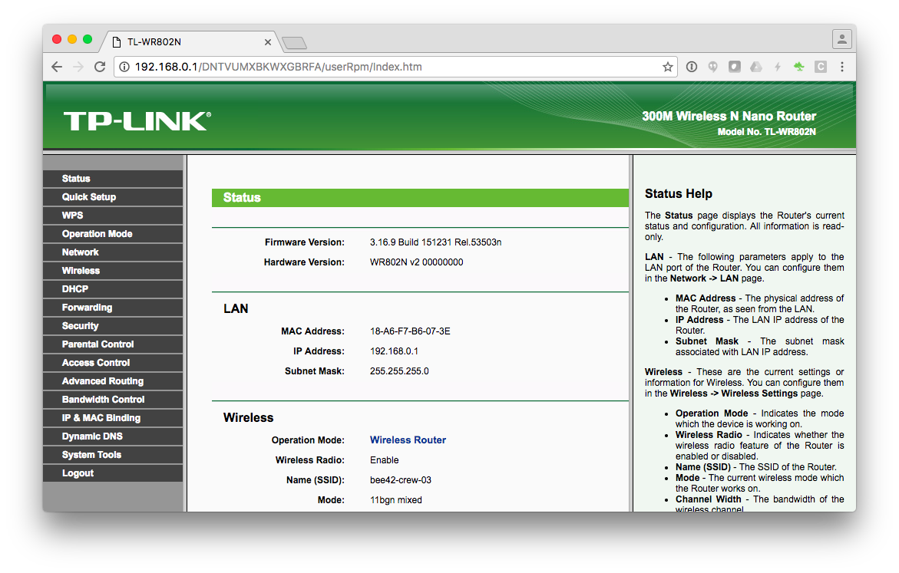
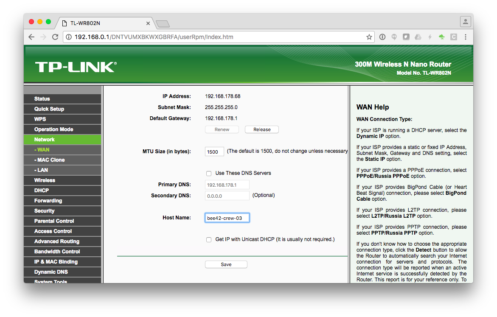
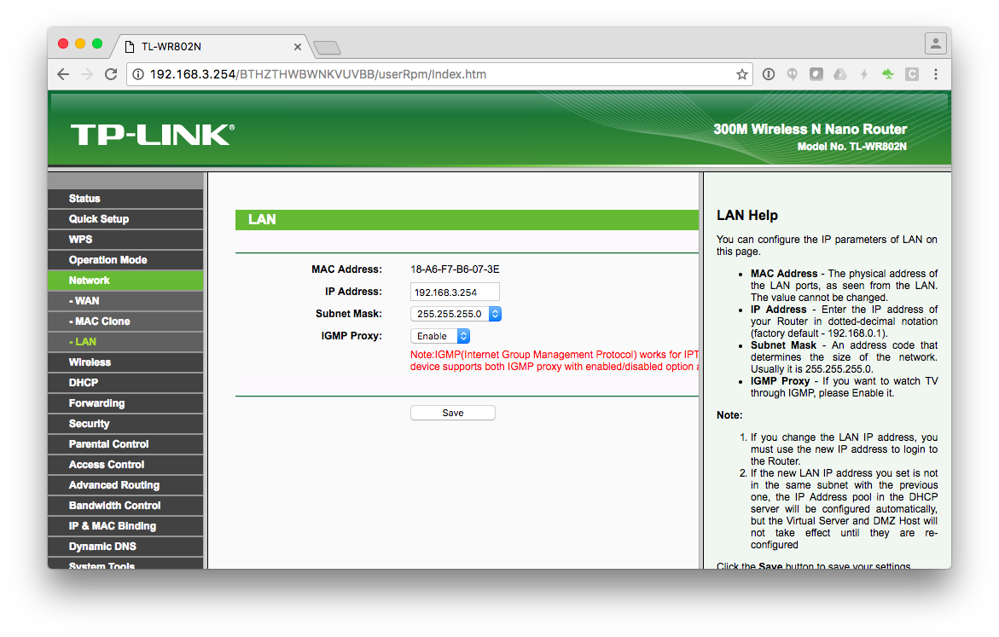
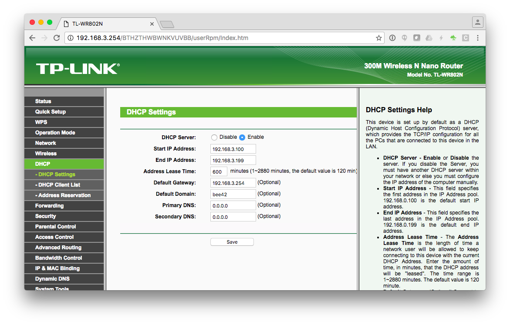
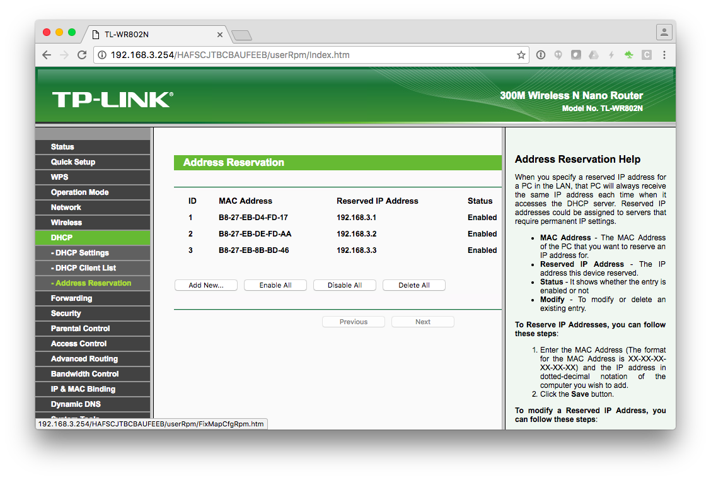

# TP-Link Mini Router Setup

Diese Anleitung hilft den TP-Link in einen einfach Router für einen Docker On ARM Swarm Cluster zu verwandeln.


## Konfiguration

* Reset des Router
* Anmelden im Router
* Ausführen des Quick Setup - Operation Mode
* Ausführen des Quick Seup - WAN Connection Type
* Ändern der WLAN SSID und Passwort
* Anmelden in dem Crew-WLAN
* Ändern des Hostnames
* Ändern der IP-Adresse des Routers
* Neuanmeldung im Router
* Deaktivieren der Firewall __WARNING__
* Ändern des Router Nutzer und ändern des Nutzer Passwords
* Feste IP-Address Vergabe

### Reset des Routers

**Mit einem frischen Router ist das nicht nötig und ihr könnt zum nächsten Schritt springen.**

Als erstes müsst ihr den Router per Hardware Reset zurücksetzen, wenn er schon vorher eine andere Konfiguration hatte.

Der Reset des Router erfolgt, wenn der Router Strom hat und dann den Schalter im kleine Loch gedrückt ist.
Nach *ca 10 sekunden* wird der Reset ausgeführt. Während dessen solltet die LED des Routers anfangen zu blinken.

Anschließend ist der TP-LINK wieder auf Werkseinstellungen und ihr könnt mit dem nächsten Schritt beginnen.

### Anmelden im Router

Der Router hat nun die IP `192.168.0.1` , wenn er in Werksmodus ist. Um sich anzumelden nimmt man folgenden Zugangsdaten

```
Account: admin
Passwort: admin
```


### Ausführen des Quick Setup - Operation Mode

Nach erfolgreicher Anmeldung kommt das Quick Setup. Hierzu muss der Operation Mode des Routers als `Wireless Router(Default)` definiert werden.
Das bedeutet, dass der Router sich den Zugang zum nächsten Netz (Internet) über den LAN Port holt (via DHCP Server des Netzes).



### Ausführen des Quick Seup - WAN Connection Type

Nachdem wir den TP-LINK als `Router` definiert haben. Es gibt die Wahl sich den Zugang der diversen Protokoll über den WAN Port zu holen.

Wir wählen hier den Mode `Dynamic IP`. Das bedeutet, dass der Router einen DHCP Client nutzt um für den WAN Port eine IP zu bekommen. Hierfür muss das da hinterliegende Netz einen DHCP Server bereitstellen.



### Ändern der WLAN SSID und Passwort

Wir haben alle unsere SSID's nach einem Schema `bee42-crew-<crew-number>`. Hierzu wählt ihr das passende Schema für eure Crew oder kommt bei uns an Board und nimmt nur eine eigene `Crew Number`.
Das WLAN-Passwort für die WLAN's ist bei uns immer `beehive42`.


Nach der Einstellung des WLAN wird nochmal eine Übersicht der vorgenommen Einstellungen angezeigt. Anschließend drückt man auf den *Finish Button* und der Router startet mit der neuen WLAN-Konfiguration.


### Anmelden in dem Crew-WLAN

Nun sollte das WLAN bei eueren Clients unter den verfügbaren WLAN-Netzen angezeigt werden. Wir haben hier ein Screenshot für unsere Beispielkonfiguration erstellt.


Eingeben des WLAN-Passworts `beehive42`


### Anmelden über den WLAN auf der Router-WLAN

Hier zu wählen wieder die `192.168.0.1`



Anschließend sollten wir diesen Status sehen:



### Ändern des Hostnames

Wir ändern den Hostname des Routers um im hinterliegenden Netz eine einfache zu Ordnung zu der IP-Addresse festzulegen. Hierfür haben wir einfach die IP-Range im dem dahinter liegenden Netz mittels nmap gescannt. Als Schema für den Hostname nehmen wir `bee42-crew-<crew-number>` es ist analog zur WLAN-SSID gewählt.



### Ändern der IP-Adresse des Routers

Wir änderen die Router-IP zu dem Netz der `Crew Number` und der Router bekommt die höchste IP-Adresse in diesem Netz. Bei uns ist das Schema dafür wie folgt.
`192.168.<crew-number>.254` . Wir wählen hier die Nummer `254`. Dann haben wir noch 253 mögliche Adressen für alle Clients im Crew-Netz.



Nach dem ändern der IP-Addresse des Routers wird automatisch wieder ein Reboot durchgeführt.


### Neuanmeldung im Router

Da wir die IP-Adresse des Routers geändert haben, müssen wir uns jetzt erneut anmelden.


### Einstellen des DHCP-Servers

Der DHCP-Server wird mit den DHCP-Settings konfiguiert. Die Konfiguration ist wie folgt zu wählen:

- Start IP Adress: `192.168.<crew-number>.1`

- End IP Address: `192.168.<crew-number>.253`

- Address Lease Time: `600` *Die bereitgestellten IP-Adresse des DHCP-Servers sind somit 10 Stunden gültig*

- Default Gateway: `192.168.<crew-number>.254`

- Default Domain: `bee42`




### Deaktivieren der Firewall __WARNING__

Um eine einfache Konfiguration zu haben, deaktivieren wir die Firewall damit wir nicht alle Ports filtern müssen die wir für unseren **LAB**-Setup brauchen.


### Ändern des Router Nutzer und ändern des Nutzer Passwords

Hierfür müssen zuerst die __Default Credentials__ eingeben werden. Anschließend können in den unteren Feldern die neuen Daten vergeben werden.

**Wichtig** Es müssen hier alle Felder ausgefühlt werden und die Anzahl der Zeichen ist auf eine Länge von `15` begrenzt.

Wenn man den selben Nutzernamen haben möchte, setzt man einfach den neuen Nutzernamen auf den Wert des Alten.


### Feste IP-Address Vergabe

Um unsere PI's einfach im Netz finden zu können, vergeben wir diesen feste IP's über die Address Reservation. Hierfür Gehen wir unter DHCP auf `Adress Reservation` und drücken den *Add New... Button*.
Hier wird nach der MAC Adresse des Netzwerk Interfaces am RPI gefragt und die gewünschte IP-Adresse. Hier für haben wir folgedenes Schema bei unseren 3 PI's gewählt.

Die `192.168.<crew-number>.1` ist ein *Manager Node* .
Die anderen beiden IP Addresen also die `192.168.<crew-number>.2` und die `192.168.<crew-number>.3` sind *Worker Nodes* .



Um zu überprüfen, ob die PI's auch die IP-Addresse bekommen haben, schauen wir uns die DHCP-Client List an die auch unter DHCP zu finden ist.


Leider haben wir noch keinen Weg gefunden, diese Schritte zu automatieren, aber für einen Tipp während wir sehr erfreut.

Niclas & Peter
